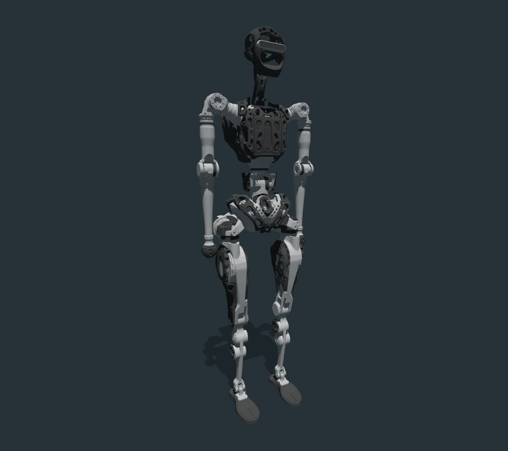
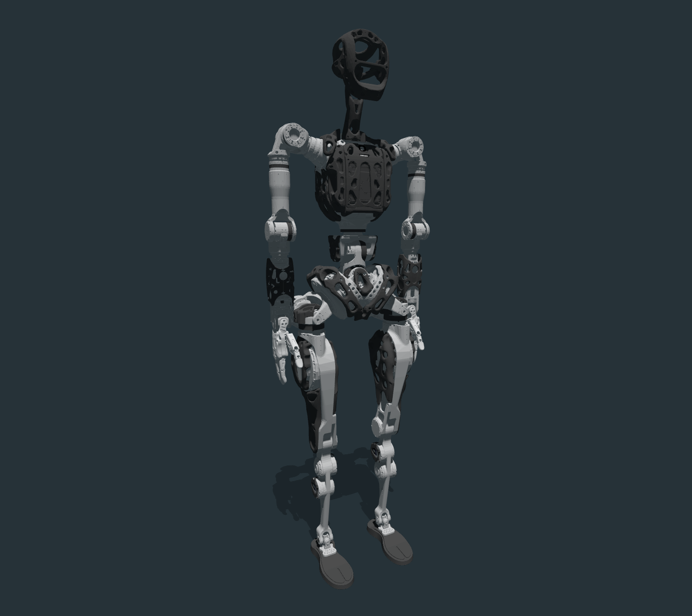
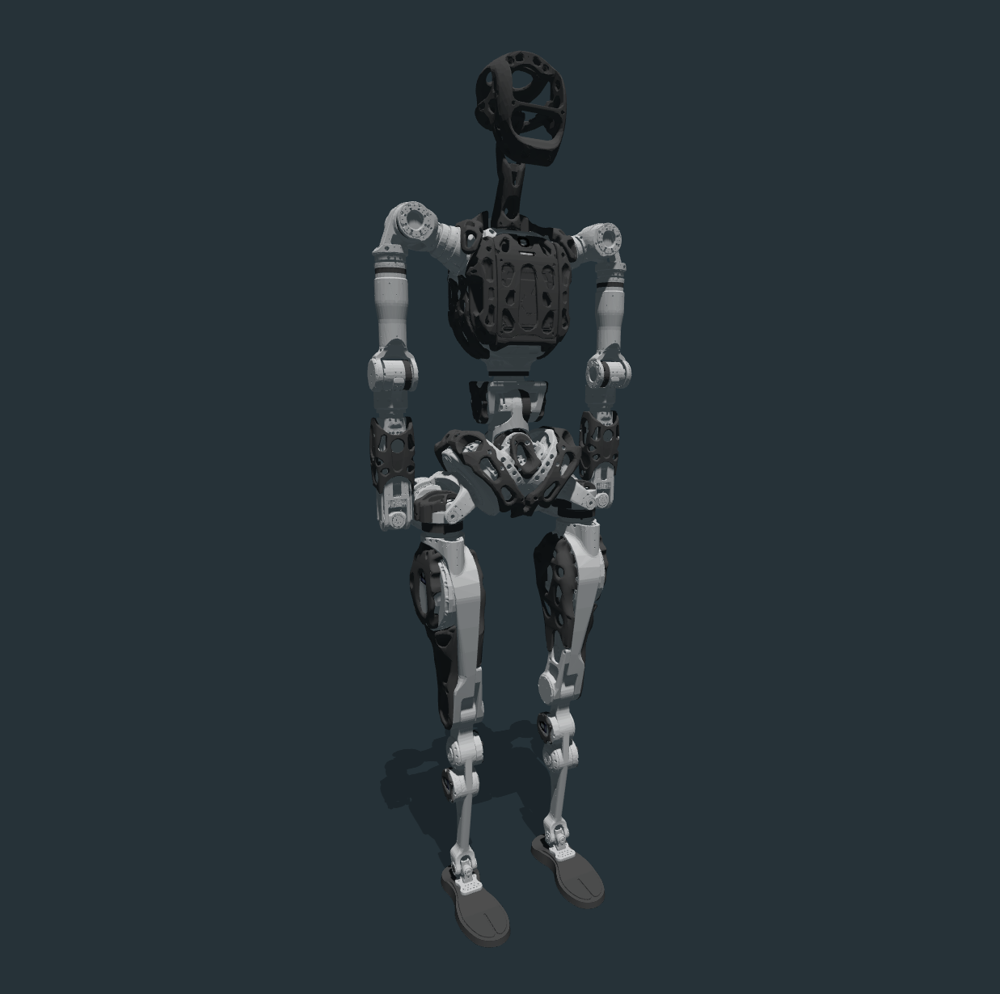

## 🔧 pnd_models

PNDbotics 模型文件仓库，包含用于仿真和控制的 URDF/MJCF 文件、网格（meshes）资源等。

---

### ⚠️ 连杆翻转说明（Toe Link Flip Issue）

如果您正在使用我们 [Wiki 文档](https://your.wiki.url) 中提供的强化学习（RL）训练示例，请务必检查以下内容，确保仿真行为正确：

#### ✅ 确认 URDF 设置：

在模型文件的 `toe_left` 和 `toe_right` 连杆配置中：

```xml
<collision name="toe_*">
  <origin rpy="1.57 0 0" xyz="0 0 0"/>
</collision>
```

请确保 `rpy="1.57 0 0"` 与 `xyz="0 0 0"` 被正确设置。

#### ✅ 修改 Isaac Gym 配置：

在相关的 `*_config.py` 配置文件中，务必设置：

```python
class asset(LeggedRobotCfg.asset):
  flip_visual_attachments = True
```

> 默认设置为 `False`，在某些模型中可能导致 toe 部件的视觉模型方向异常。

---


## models

| model name     | mujoco image                                                      |
| -------------- | ----------------------------------------------------------------- |
| adam_inspire   |        |
| adam_lite      |                 |
| adam_lite_agx  |     |
| adam_sp        |                       |
| adam_sp_agx_ir |  |
| adam_standard  |     |
| adam_u         |                          |

## FAQ

