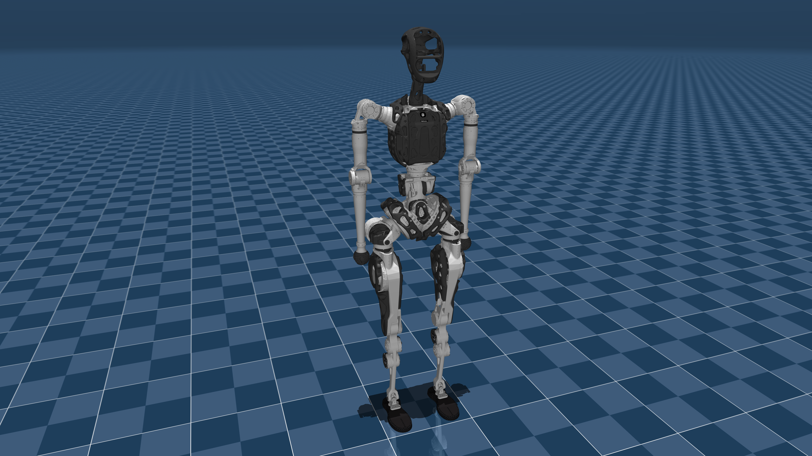
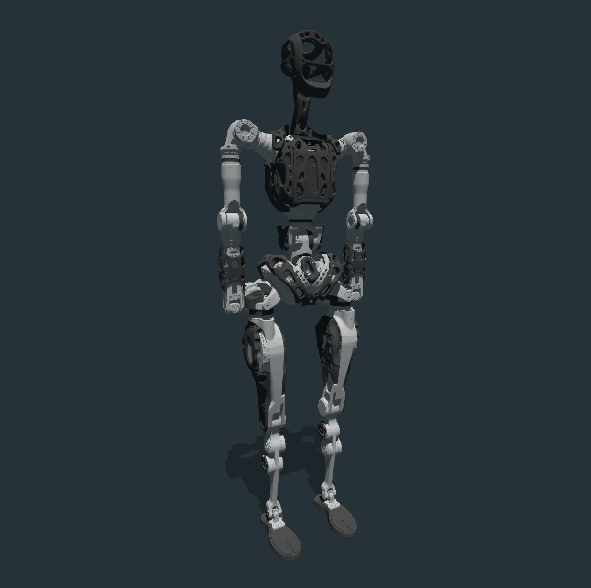
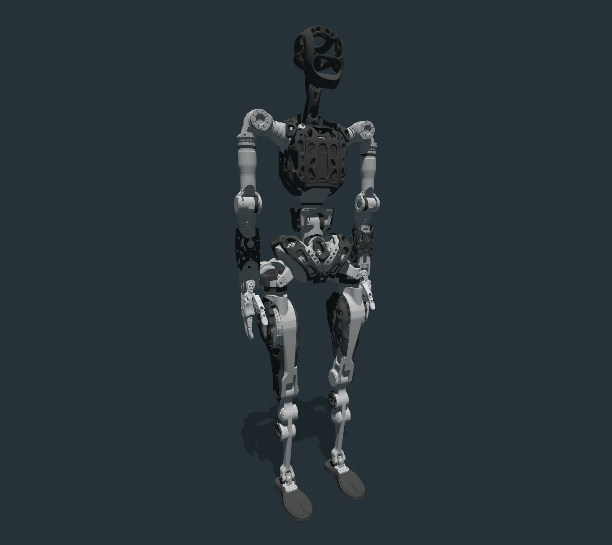
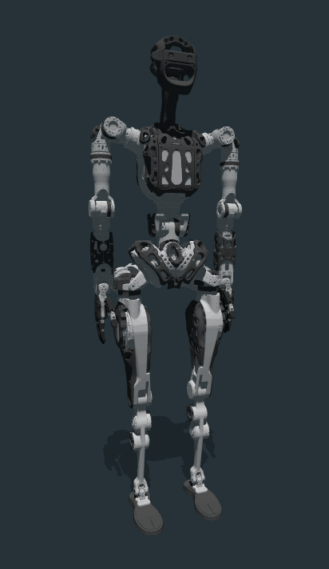
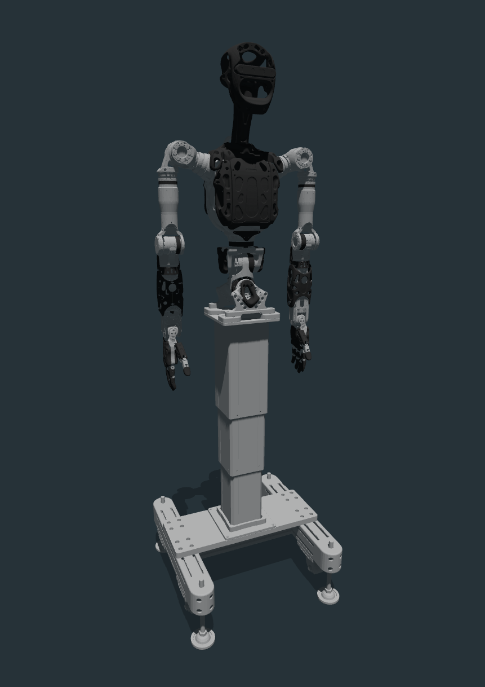

## 🔧 pnd_models

This repository contains PNDbotics model files for simulation and control, including URDF/MJCF descriptions, mesh assets, and more.

---

### ⚠️ Link Orientation Notice (Toe Link Flip Issue)

If you're using the reinforcement learning (RL) examples provided in our [Wiki documentation](https://your.wiki.url), please double-check the following to ensure correct simulation behavior:

#### ✅ URDF Configuration

In the `toe_left` and `toe_right` link definitions, make sure the following configuration is set:

```xml
<collision name="toe_*">
  <origin rpy="1.57 0 0" xyz="0 0 0"/>
</collision>
```

This orientation ensures the correct alignment of toe links in simulation.

#### ✅ Isaac Gym Configuration

In the corresponding `*_config.py` file used for Isaac Gym training, be sure to set:

```python
flip_visual_attachments = True
```

> The default value is `False`, which may cause visual misalignment of the toe components in some models.

---

## models

| model name    | image                                                          | description                                   |
| ------------- | -------------------------------------------------------------- | --------------------------------------------- |
| adam_lite     |              | TODO                                          |
| adam_standard |  | generated by adam_sp/generate_standard.ipynb. |
| adam_sp       |                    |                                               |
| adam_pro      |                 |                                               |
| adam_u        |                       |                                               |

## FAQ
