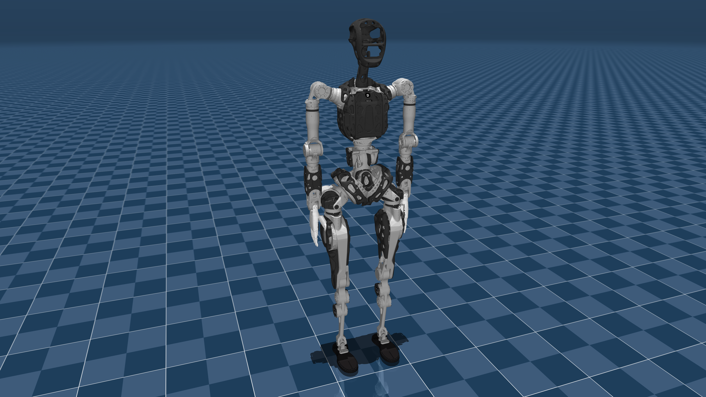

# pnd_models

PNDbotics model files (urdf/mjcf + meshes, etc)

### 连杆翻转问题

如果您使用了wiki中提供的RL例程
请确认urdf中toe_left 以及 toe_right中的为以下值  
collision name="toe_*"  
origin rpy="1.57 0 0" xyz="0 0 0"  
请在isaac_gym的代码里 *_config 中的
`flip_visual_attachments = False`改为`flip_visual_attachments = True`  

## models

| model name     | mujoco image                                                      |
| -------------- | ----------------------------------------------------------------- |
| adam_inspire   |        |
| adam_lite      |                 |
| adam_lite_agx  |     |
| adam_sp        |                       |
| adam_sp_agx_ir |  |
| adam_standard  |     |
| adam_u         |                          |

## FAQ

